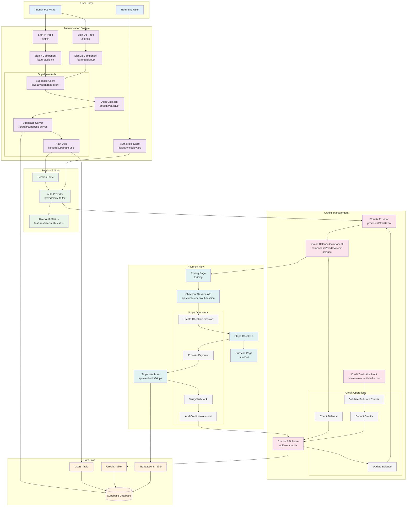

# Fullstack Chat Repository Overview

```mermaid
graph TB
    %% User Interface Layer
    subgraph "Frontend (Next.js 14)"
        UI[Chat Interface]
        AUTH_UI[Auth Pages<br/>signin/signup]
        PRICING[Pricing Page]
        NAVBAR[Navigation<br/>w/ Credit Balance]
    end

    %% Authentication System
    subgraph "Authentication"
        SUPABASE[Supabase Auth]
        AUTH_MW[Auth Middleware]
        AUTH_CB[Auth Callback]
    end

    %% Core Chat Features
    subgraph "Chat System"
        THREAD[Thread Management]
        AGENT_INBOX[Agent Inbox<br/>w/ Interrupts]
        MESSAGES[Message Components<br/>AI/Human/Tool]
        ARTIFACTS[Artifacts & Previews]
    end

    %% LangGraph Integration
    subgraph "LangGraph JS"
        GRAPHS[Graph Deployments]
        TOOLS[Tool Calls]
        INTERRUPTS[Interrupt Handling]
        STREAM[Streaming Responses]
    end

    %% Credits System
    subgraph "Credits Management"
        CREDIT_BAL[Credit Balance]
        CREDIT_HOOK[Credit Deduction Hook]
        CREDIT_API[Credits API]
    end

    %% Payment System
    subgraph "Payments (Stripe)"
        CHECKOUT[Checkout Session]
        WEBHOOKS[Stripe Webhooks]
        SUCCESS[Success Page]
    end

    %% API Layer
    subgraph "API Routes"
        GRAPH_API[Graph API<br/>[..._path]]
        USER_API[User/Credits API]
        PAYMENT_API[Payment APIs]
        WEBHOOK_API[Webhook Handlers]
    end

    %% Data Flow Connections
    UI --> THREAD
    AUTH_UI --> SUPABASE
    PRICING --> CHECKOUT

    SUPABASE --> AUTH_MW
    AUTH_MW --> UI
    AUTH_CB --> SUPABASE

    THREAD --> AGENT_INBOX
    AGENT_INBOX --> MESSAGES
    AGENT_INBOX --> ARTIFACTS

    THREAD --> GRAPH_API
    GRAPH_API --> GRAPHS
    GRAPHS --> TOOLS
    GRAPHS --> INTERRUPTS
    GRAPHS --> STREAM

    NAVBAR --> CREDIT_BAL
    CREDIT_BAL --> CREDIT_API
    CREDIT_HOOK --> USER_API

    CHECKOUT --> PAYMENT_API
    PAYMENT_API --> WEBHOOKS
    WEBHOOKS --> WEBHOOK_API
    WEBHOOKS --> CREDIT_API
    SUCCESS --> PRICING

    %% Styling
    classDef frontend fill:#e1f5fe
    classDef auth fill:#f3e5f5
    classDef chat fill:#e8f5e8
    classDef langgraph fill:#fff3e0
    classDef credits fill:#fce4ec
    classDef payments fill:#e0f2f1
    classDef api fill:#f5f5f5

    class UI,AUTH_UI,PRICING,NAVBAR frontend
    class SUPABASE,AUTH_MW,AUTH_CB auth
    class THREAD,AGENT_INBOX,MESSAGES,ARTIFACTS chat
    class GRAPHS,TOOLS,INTERRUPTS,STREAM langgraph
    class CREDIT_BAL,CREDIT_HOOK,CREDIT_API credits
    class CHECKOUT,WEBHOOKS,SUCCESS payments
    class GRAPH_API,USER_API,PAYMENT_API,WEBHOOK_API api
```

---

## Detailed Auth & Credits Flow



## Key Components Overview

### 🔐 Authentication

- **Supabase Auth**: Handles user authentication and session management
- **Auth Middleware**: Protects routes and manages user sessions
- **Auth Pages**: Sign-in and sign-up user interfaces

### 💬 Chat System

- **Thread Management**: Organizes conversation flows
- **Agent Inbox**: Handles AI agent interactions with interrupt capabilities
- **Message Components**: Renders different message types (AI, Human, Tool calls)
- **Artifacts**: Displays rich content and previews

### 🤖 LangGraph Integration

- **Graph Deployments**: Connects to LangGraph JS SDK for AI workflows
- **Tool Calls**: Executes and displays tool interactions
- **Interrupt Handling**: Manages conversation interrupts and user input
- **Streaming**: Real-time response streaming

### 🪙 Credits System

- **Credit Balance**: Displays user's available credits
- **Credit Deduction**: Automatically deducts credits for AI interactions
- **Credits API**: Manages credit transactions and balance updates

### 💳 Payments (Stripe)

- **Checkout Sessions**: Handles payment processing
- **Webhooks**: Processes payment confirmations
- **Success Flow**: Confirms successful purchases and credit additions

### 🔌 API Layer

- **Graph API**: Proxies requests to LangGraph deployments
- **User/Credits API**: Manages user data and credit operations
- **Payment APIs**: Handles Stripe integration
- **Webhook Handlers**: Processes external service callbacks
